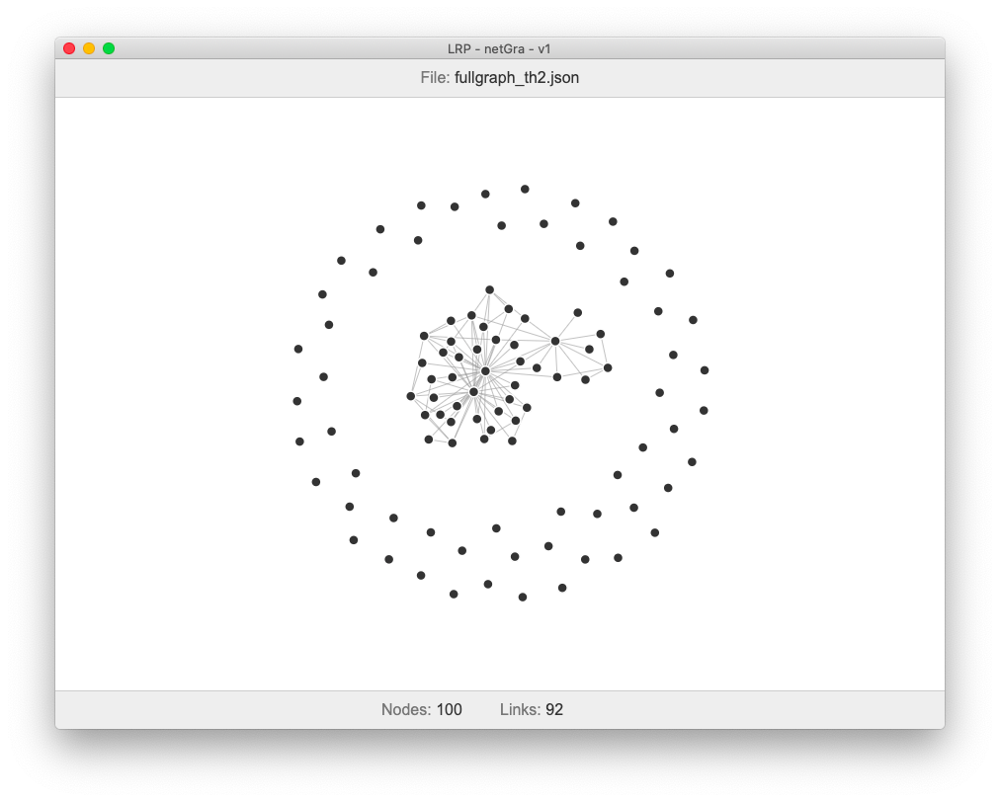

# LRP netGra v1.0

The very first version of a graph viewer.

Displays a simple network graph using D3JS library.

The input graph file has to be formated properly.

    {
        "nodes": [
            {"id": 0, "name": "node a"},
            {"id": 1, "name": "node b"},
            {"id": 2, "name": "node c"}
        ];
        "links": [
            {"source": 0, "target": 2}
            {"source": 2, "target": 3}
        ]
    }

# Installing it

I am assuming you have NodeJS and Electron installed on your computer.

clone the repo then `cd` into it.

Install the three dependencies

    npm install electron d3 fs --save-dev

# Running it

As long as you are still in the project directory, all you need to do is...

 `npm start`

That's it.

If you've set it up properly (and you have a properly formatted graph) is should look like this.

